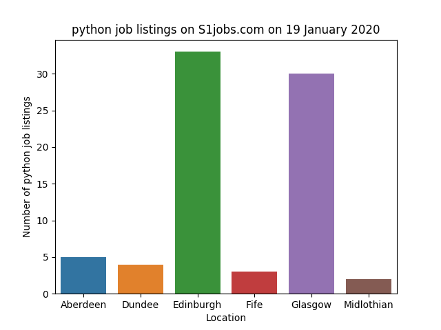

# python-demo
Working example of using Python 3 to browse for, extract, transform and analyse data.

## What it does

* Search S1Jobs.com for a variable keyword, in this case `python`
* Extract key information from each job listing
* Iterate through multiple pages of results
* Perform simple summarisations for location and advertiser
* Clean text strings
* Perform simple frequency analysis on job titles

## What it can tell us

* Where are the `python` jobs in Scotland?
* Who is advertising the jobs?
* * Are there particular companies/recruiters who a `python` professional should engage with?
* Which other job title terms appear frequently in the `python` job market?
* * Which skills should `python` professionals consider developing?

## What it shows us

On running the script, initial outputs will show the web requests getting the HTML documents from S1Jobs.com

```
Fetching page 1
Fetching page 2
Fetching page 3
...
```

The `browser` module handles web requests and the Python package `BeautifulSoup` parses the HTML document to text ready for data extraction.

The `extractor` module's `resultsToDf` function is called on each page, initially trimming the text document down to only the relevant `<div>` element, and then using the `parser` module's `selectToString` function to find values by CSS selectors and append the values into a data frame.

The whole process is repeated until there are no more job listings left to read, and the populated data frame is ready for review.

The first bit of insight returned is the total volume of job listings extracted by the scraper.

```
# How many jobs did we find?

print(len(df.index))
```

```
77
```

Good to know, but not useful on it's own. So we apply some groupings and a summarisation to the returned data frame to display the number of listings in each town/city.

```
where = df.groupby(["loc"], as_index=False)["job"].count()
```

Then we visualise using Python's `Seaborn` package

```
# Then, plot with location on the x axis and count of job on the y

where_plot = sns.barplot(x = "loc", y = "job", data = where)

# Set some axis labels
where_plot.set(xlabel = "Location", ylabel = "Number of " + keyword + " job listings")

# Set the chart title
where_plot.set_title(keyword + " job listings on S1jobs.com on " + datetime.today().strftime("%d %B %Y"))

# Save the chart to a png in the plots directory
where_plot.get_figure().savefig("where-are-jobs-located.png")
```

From which we see:



If you're a Python person, and live in Edinburgh or Glasgow there's a decent amount of choice (and probably plenty of competition). Much less so if you're looking for a job using Python in Midlothian or Fife.

Next, we'll have a look at who is advertising these roles. If you're in the market for a job, you're going to want to be on the books with recruiters who specialise in those skills, so who are they?

```
## Who is advertising the roles?
# First, group the df on by (advertiser), counting each job

who = df.groupby(["by"], as_index=False)["job"].count()

# Then, sort by greatest to least. No visualisation for this one, table is best for long categorical lists like this.

who = who.sort_values(by = ["job"] , ascending = False)

print(who)
```

```
by  job
Be-IT Resourcing Ltd   20
HAYS    7
Search Consultancy    6
Eden Scott    4
Harvey Nash    4
Nine Twenty Technology    4
Police Scotland    3
...
```

So we can see that Be-IT listed by far the most Python roles on the day we collected the data. The first actual exployer to appear on the list is Police Scotland. So, probably a good idea for Python folk to get acquainted with the top names, and maybe figure out how to fight crime with code.

The last step taken was to show us the words which often appear in the job titles, to give us some insight into the role levels or additional skills which are commonly being sought in the market that day.

```
# Word profiling, which words are common in job titles

# First, let's clean the data, removing some commonly used symbols and stop words which aren't useful in the analysis

chars_to_remove = ["!","£","$","%","^","&","*","-","_","=",")","(","[","]","{","}","~","@",":",";","/","?",">",",","<","|"]

for char in chars_to_remove:
  df["job"] = df["job"].str.replace(char,"")

# Some symbols are left, as they are legitimate. e.g. C#, C++, .NET etc.

# Set the column to lowercase

df["job"] = df["job"].str.lower()

# Initialise a list

titles_list = []

# Iterate through rows the data
# Range of 0 to last row will iterate through all rows

for row in range(0,len(df.index)):

  # Convert value to string, then split on whitespace
  # Access by index, iterate rows, always column 0

  job_words = df.iloc[row,0].split(" ")

  # Append the strings to the list

  titles_list.append(job_words)

  # Increment row number

  row = row + 1

# Flatten the word list of lists

flat_word_list = []

# Iterate through each list

for sublist in titles_list:

  # Go into each list nest and append the items to the flat_word_list

    for item in sublist:
        flat_word_list.append(item)

# Make this a dataframe for grouping later

words = pd.DataFrame(flat_word_list)

# Give the columns sensible names, and add a count for summing

words.columns = ["word"]
words["count"] = 1

# Group by word, to get a count of appearances

wordgroup = words.groupby(["word"], as_index = False)["count"].sum()

# Sort high to low, to see most popular words

wordgroup = wordgroup.sort_values(by = ["count"] , ascending = False)

# Drop invalid rows (there's often non-printing spaces creeping in)

wordgroup = wordgroup[wordgroup["word"] != ""]

# Let's look at the whole dataframe

print(wordgroup.to_string())
```

```
word  count
engineer     30
developer     19
software     15
devops     15
test     15
glasgow     15
junior     13
analyst     13
...
```

The top values returned here show us that 30 of the 77 listings mention 'engineer' in the title. 'devops' is also popular, so wothwhile knowing plenty about infrastructure and all the behind-the-code magic.

## Summary

The scripts have taken raw data from the web, ingested it, cleaned it and presented it an eaily digestible format.

The script would be reusable, so it could feasibly perform the same task for single-word role or skill based searches.